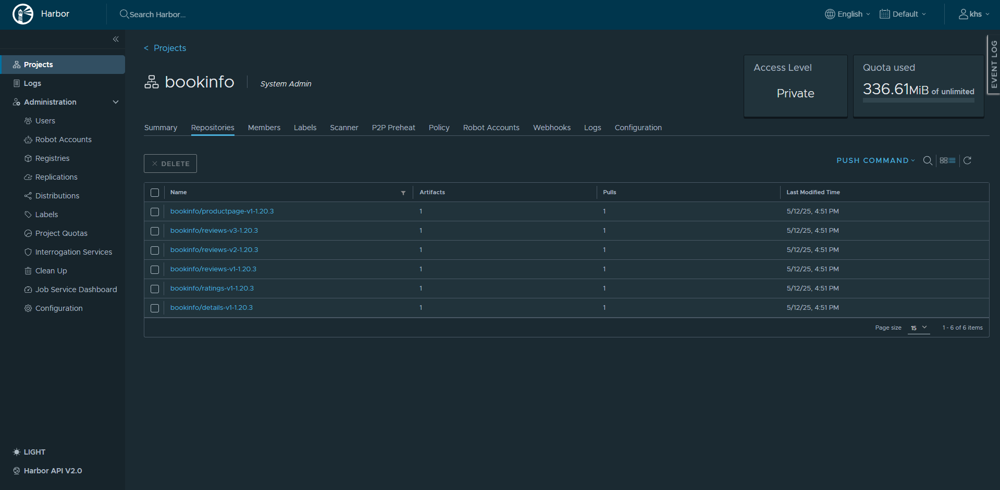

# 📦 Bookinfo Deployment with Harbor Private Registry and SSL on EC2

This project demonstrates deploying the [Bookinfo microservices application](https://istio.io/latest/docs/examples/bookinfo/) using Docker images hosted on a **private Harbor registry** deployed on an **AWS EC2 instance** with **SSL configured via Route 53**. The Kubernetes manifests are configured to pull images securely using `imagePullSecrets`.

## 📚 Table of Contents

- [Architecture Overview](#architecture-overview)
- [✅ Pre-requisites](#pre-requisites)
- [1. Setup SSL with Route 53](#2-setup-ssl-with-route-53)
- [2. Deploy Harbor on EC2](#1-deploy-harbor-on-ec2)
- [3. Push Docker Images to Harbor](#3-push-docker-images-to-harbor)
- [4. Deploy Bookinfo on Kubernetes](#4-deploy-bookinfo-on-kubernetes)
- [5. Accessing the Application](#5-accessing-the-application)

---

## 🏗 Architecture Overview

This is the overview of Harbor and Private Repo
```bash
Internet ──► Route 53 (DNS) ──► EC2 (Harbor + SSL)
                                 │
                                 ▼
                           Private Registry
                                 │
                                 ▼
                      Kubernetes Cluster (Local VM)
                       ├── details
                       ├── ratings
                       ├── reviews (v1, v2, v3)
                       └── productpage
```
This is the bookinfo architecture


---

## ✅ Pre-requisites
- AWS account with access to EC2 and Route 53

- A registered domain name in Route 53

- Kubernetes cluster (e.g., EKS, k3s, Minikube)

- Docker CLI

- kubectl configured for your cluster

---

- **🔒 Setup SSL with Route 53**
   1. Create an A record in your Route 53 hosted zone:

      - **Name:** `harbor.<your-domain>`
      - **Type:** `A`
      - **Value:** EC2 public IP

   2. Obtain and configure SSL certificates:

      - You can use Let's Encrypt, ZeroSSL, or your internal CA. Here I use this terraform code to create acme certificate with Route 53.
        - (https://github.com/sailinnthu/terraform-acme-tls-aws)
        - You need to install terraform and aws cli and also need to attach Route 53 role to that EC2 and run terraform to create ACME certificate with your desired domain.
        - After running terraform you can see below there will be cert files.
        
        
      
      - Ensure port **443** is open in your EC2 security group. And you need EC2 role to access Route 53.
     
- **🛠 Deploy Harbor on EC2**

  - **Launch an EC2 instance (Ubuntu preferred).**
  - **Install Docker and Docker Compose.**
  - **Download and configure Harbor:**
    ```bash
        wget https://github.com/goharbor/harbor/releases/download/v2.9.0/harbor-online-installer-v2.9.0.tgz
        tar -xzf harbor-online-installer-v2.9.0.tgz
        cd harbor
        cp harbor.yml.tmpl harbor.yml
        ```
  - **Modify harbor.yml:**
    ```bash
        hostname: harbor.<your-domain>
          https:
          port: 443
          certificate: /path/to/your/fullchain.pem
          private_key: /path/to/your/privkey.pem
        ```
  - **Install Harbor**
   ```bash
        sudo ./install.sh
   ```
- **Create a user to push/pull your images (Tested on EC2)**
  - Go to https://harbor.(your-domain)
  - Goto Administration>Users>+New User
  - Goto Projects. Create New Project if you want to push your images under one repo
  
   

          
- **🐳 Push Docker Images to Harbor**

  1. Login to Harbor
     - ```bash
       docker login harbor.<your-domain>
       ```
  2. Tag and push images:
     - ```bash
       docker tag details-v1 harbor.<your-domain>/bookinfo/details-v1-1.20.3
       docker push harbor.<your-domain>/bookinfo/details-v1-1.20.3
       ```
       ***(Repeat for other images: ratings, reviews-v1/v2/v3, productpage)***
     - Should be as below

     

- **☸️ Deploy Bookinfo on Kubernetes (Tested on Local VM)**

  1. Clone this repo
     - ```bash
       git clone https://github.com/KHS-cpu/bookinfo.git
       cd bookinfo
       ```
  2. Create Namespaces and Image Pull Secrets:
     - ```bash
       ./create-ecr-secret.sh
       ```
  3. Apply the Bookinfo YAML manifests:
     - ```bash
       kubectl apply -f bookinfo-deployment.yaml
       ```
  4. Verify deployments:
     - ```bash
       kubectl get pods -A
       ```
       ***(Pods should not be `ErrImagePull`, if you are having error check with `kubectl describe pod <pod-name> -n <namespace>`***

- **🌐 Accessing the Application**
  - **You can expose the productpage service using:**
    - Option 1: Port Forwarding (Dev Only)
      - ```bash
        kubectl port-forward --address 0.0.0.0 svc/productpage 9080:9080 -n productpage
        ```
        Visit `http://localhost:9080`
    - Option 2: Ingress or LoadBalancer
      - Configure an ingress controller or service of type LoadBalancer.
     
- **🔐 Security Note**
  - Avoid hardcoding credentials (e.g., in secrets) for production. Use Kubernetes Secrets with KMS, HashiCorp Vault, or IRSA on EKS for enhanced security.
 
- **🔮 What's Next / Future Improvements**
  - Automate Harbor Deployment
    - Fully use Terraform to automate Harbor installation and DNS record creation.
  - Enable Harbor High Availability (HA)
    - Deploy Harbor in an HA setup using multiple EC2 instances and an external database like PostgreSQL and Redis.
  - Integrate with GitHub Actions or Jenkins
    - Automate the CI/CD pipeline to build and push Docker images to Harbor upon code changes.
  - Configure Harbor with S3 as Backend Storage
    - Offload storage from EC2 to S3 for better durability and scalability.
  - Ingress Controller with HTTPS
    - Replace direct SSL with NGINX Ingress + Cert-Manager for managed TLS on Kubernetes side.


